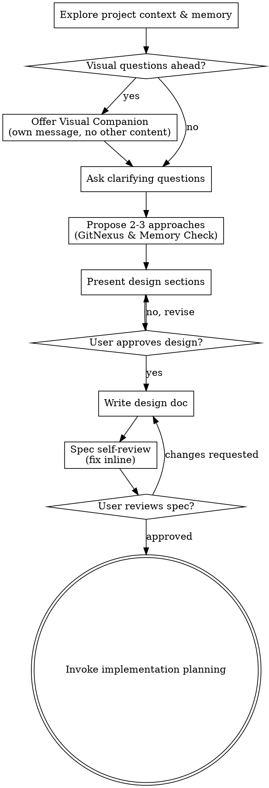

# Brainstorm Skill (/brainstorm)

This skill implements the Superpowers brainstorming workflow combined with GitNexus for dependency mapping and AgentMemory for historical constraint verification.

Start by understanding the current project context, then ask questions one at a time to refine the idea. Once you understand what you're building, present the design and get user approval.

<HARD-GATE>
Do NOT invoke any implementation skill, write any code, scaffold any project, or take any implementation action until you have presented a design and the user has approved it. This applies to EVERY project regardless of perceived simplicity.
</HARD-GATE>

## Anti-Pattern: "This Is Too Simple To Need A Design"

Every project goes through this process. A todo list, a single-function utility, a config change — all of them. "Simple" projects are where unexamined assumptions cause the most wasted work. The design can be short (a few sentences for truly simple projects), but you MUST present it and get approval.

## Checklist

You MUST create a task for each of these items and complete them in order:

1. **Explore project context & initialize memory** — Call `agentmemory`/`openclaw-memory` to query for past design discussions or historical pitfalls, and run `gitnexus.context` or view files to inspect the current codebase structure.
2. **Offer visual companion** (if topic will involve visual questions) — This is its own message, not combined with a clarifying question. See the Visual Companion section below.
3. **Ask clarifying questions** — One at a time, understand purpose/constraints/success criteria.
4. **Propose 2-3 approaches** — Outline at least 3 different approaches, map required files/blast radius using `gitnexus.impact` or `gitnexus.query`, check memory constraints, and present a comparison table of Complexity, Blast Radius (GitNexus), memory constraints, and time to implement/verify. Highlight your recommendation first.
5. **Present design** — In sections scaled to their complexity, get user approval after each section.
6. **Write design doc** — Save to `docs/superpowers/specs/YYYY-MM-DD-<topic>-design.md` and commit.
7. **Spec self-review** — Quick inline check for placeholders, contradictions, ambiguity, scope (see below).
8. **User reviews written spec** — Ask user to review the spec file before proceeding.
9. **Transition to implementation** — Transition to Phase 3 of the workflow (write `implementation_plan.md` using `/solve` or `/workflow` planning phase).

## Process Flow

**The terminal state is invoking implementation planning.** Do NOT invoke frontend-design, mcp-builder, or any other implementation skill. The ONLY skill you invoke after brainstorming is writing-plans (or the planning phase of `/solve` / `/workflow`).

---

## The Process

### 1. Understanding the idea:

*   **Query Memory & Codebase Structure First:** Check the current project state (files, docs, recent commits). Specifically, call `agentmemory`/`openclaw-memory` to query for past design discussions or historical pitfalls, and run `gitnexus.context` to inspect current code structure.
*   **Assess Scope Early:** Before asking detailed questions, assess scope: if the request describes multiple independent subsystems (e.g., "build a platform with chat, file storage, billing, and analytics"), flag this immediately. Don't spend questions refining details of a project that needs to be decomposed first.
*   **Decompose Large Projects:** If the project is too large for a single spec, help the user decompose into sub-projects: what are the independent pieces, how do they relate, what order should they be built? Then brainstorm the first sub-project through the normal design flow. Each sub-project gets its own spec → plan → implementation cycle.
*   **Clarifying Questions:** For appropriately-scoped projects, ask questions one at a time to refine the idea.
*   **Question Format:** Prefer multiple choice questions when possible, but open-ended is fine too.
*   **Single Focus:** Only one question per message - if a topic needs more exploration, break it into multiple questions.
*   **Understanding Goals:** Focus on understanding: purpose, constraints, success criteria.

### 2. Exploring approaches:

*   **Generate at least 3 approaches:** Propose 2-3 different approaches with trade-offs (e.g., Approach A: Simple inline fix, Approach B: Refactor module, Approach C: Add helper utility).
*   **Map Dependencies & Blast Radius:** For each proposed approach, call `gitnexus.impact` or `gitnexus.query` to map out the required files, call chains, or library dependencies. Evaluate affected components and downstream impact comparison.
*   **Historical memory checks:** Check `agentmemory`/`openclaw-memory` for past design discussions, performance pitfalls, or constraints related to the modules targetted by each approach. Exclude any approaches that repeat past failures.
*   **Present comparison table:** Detail in a clear table:
    *   Complexity (Karpathy's Simplicity First principle).
    *   Blast Radius (GitNexus).
    *   Memory constraints (AgentMemory).
    *   Time to implement and verify.
*   **Lead with recommendation:** Present options conversationally with your recommendation and reasoning first.

### 3. Presenting the design:

*   **Scale sections to complexity:** Once you believe you understand what you're building, present the design. Scale each section to its complexity: a few sentences if straightforward, up to 200-300 words if nuanced.
*   **Ask after each section:** Ask after each section whether it looks right so far.
*   **Cover all bases:** Cover: architecture, components, data flow, error handling, testing.
*   **Refinement:** Be ready to go back and clarify if something doesn't make sense.

### 4. Design for isolation and clarity:

*   **Single Purpose Units:** Break the system into smaller units that each have one clear purpose, communicate through well-defined interfaces, and can be understood and tested independently.
*   **Evaluate Boundaries:** For each unit, you should be able to answer: what does it do, how do you use it, and what does it depend on? Can someone understand what a unit does without reading its internals? Can you change the internals without breaking consumers? If not, the boundaries need work.
*   **Focused Files:** Smaller, well-bounded units are also easier for you to work with - you reason better about code you can hold in context at once, and your edits are more reliable when files are focused. When a file grows large, that's often a signal that it's doing too much.

### 5. Working in existing codebases:

*   **Follow Patterns:** Explore the current structure using `gitnexus.context` before proposing changes. Follow existing patterns.
*   **Include Targeted Improvements:** Where existing code has problems that affect the work (e.g., a file that's grown too large, unclear boundaries, tangled responsibilities), include targeted improvements as part of the design - the way a good developer improves code they're working in.
*   **Stay Focused:** Don't propose unrelated refactoring. Stay focused on what serves the current goal.

---

## After the Design

### Documentation:

*   **Spec File Path:** Write the validated design (spec) to `docs/superpowers/specs/YYYY-MM-DD-<topic>-design.md` (unless user preferences override this path).
*   **Commit to Git:** Commit the design document to git.

### Spec Self-Review:
After writing the spec document, look at it with fresh eyes:

1.  **Placeholder scan:** Any "TBD", "TODO", incomplete sections, or vague requirements? Fix them.
2.  **Internal consistency:** Do any sections contradict each other? Does the architecture match the feature descriptions?
3.  **Scope check:** Is this focused enough for a single implementation plan, or does it need decomposition?
4.  **Ambiguity check:** Could any requirement be interpreted two different ways? If so, pick one and make it explicit.

Fix any issues inline. No need to re-review — just fix and move on.

### User Review Gate:
After the spec review loop passes, ask the user to review the written spec before proceeding:

> "Spec written and committed to `<path>`. Please review it and let me know if you want to make any changes before we start writing out the implementation plan."

Wait for the user's response. If they request changes, make them and re-run the spec review loop. Only proceed once the user approves.

### Implementation Transition:

*   Invoke the implementation planning phase (write `implementation_plan.md` using `/solve` or `/workflow` planning phase).
*   Do NOT invoke any other skill. Planning is the next step.

---

## Key Principles

*   **One question at a time** - Don't overwhelm with multiple questions.
*   **Multiple choice preferred** - Easier to answer than open-ended when possible.
*   **YAGNI ruthlessly** - Remove unnecessary features from all designs.
*   **Explore alternatives** - Always propose 2-3 approaches before settling.
*   **Incremental validation** - Present design, get approval before moving on.
*   **Be flexible** - Go back and clarify when something doesn't make sense.

---

## Visual Companion

A browser-based companion for showing mockups, diagrams, and visual options during brainstorming. Available as a tool — not a mode. Accepting the companion means it's available for questions that benefit from visual treatment; it does NOT mean every question goes through the browser.

*   **Offering the companion:** When you anticipate that upcoming questions will involve visual content (mockups, layouts, diagrams), offer it once for consent:
    > "Some of what we're working on might be easier to explain if I can show it to you in a web browser. I can put together mockups, diagrams, comparisons, and other visuals as we go. This feature is still new and can be token-intensive. Want to try it? (Requires opening a local URL)"
*   **Separate Message constraint:** This offer MUST be its own message. Do not combine it with clarifying questions, context summaries, or any other content. The message should contain ONLY the offer above and nothing else. Wait for the user's response before continuing. If they decline, proceed with text-only brainstorming.
*   **Per-question decision:** Even after the user accepts, decide FOR EACH QUESTION whether to use the browser or the terminal. The test: **would the user understand this better by seeing it than reading it?**
    *   **Use the browser** for content that IS visual — mockups, wireframes, layout comparisons, architecture diagrams, side-by-side visual designs.
    *   **Use the terminal** for content that is text — requirements questions, conceptual choices, tradeoff lists, A/B/C/D text options, scope decisions.
*   **Detailed Guide:** If they agree to the companion, read the detailed guide before proceeding: `skills/brainstorming/visual-companion.md`

---

## 🧠 Karpathy-Inspired Coding Guidelines

To ensure robust and maintainable code, always follow these four core principles inspired by Andrej Karpathy:

### 1. Think Before Coding
**Don't assume. Don't hide confusion. Surface tradeoffs.**
*   State your assumptions explicitly. If uncertain, ask.
*   If multiple interpretations exist, present them - don't pick silently.
*   If a simpler approach exists, say so. Push back when warranted.
*   If something is unclear, stop. Name what's confusing. Ask.

### 2. Simplicity First
**Minimum code that solves the problem. Nothing speculative.**
*   No features beyond what was asked.
*   No abstractions for single-use code.
*   No "flexibility" or "configurability" that wasn't requested.
*   No error handling for impossible scenarios.
*   If you write 200 lines and it could be 50, rewrite it.
*   Ask yourself: "Would a senior engineer say this is overcomplicated?" If yes, simplify.

### 3. Surgical Changes
**Touch only what you must. Clean up only your own mess.**
*   Don't "improve" adjacent code, comments, or formatting.
*   Don't refactor things that aren't broken.
*   Match existing style, even if you'd do it differently.
*   If you notice unrelated dead code, mention it - don't delete it.
*   Remove imports/variables/functions that YOUR changes made unused. Don't remove pre-existing dead code unless asked.
*   Every changed line should trace directly to the user's request.

### 4. Goal-Driven Execution
**Define success criteria. Loop until verified.**
*   Transform tasks into verifiable goals (e.g., "Add validation" -> "Write tests for invalid inputs, then make them pass").
*   For multi-step tasks, state a brief plan and verify each step.
*   Strong success criteria let you loop independently. Weak criteria require constant clarification.
