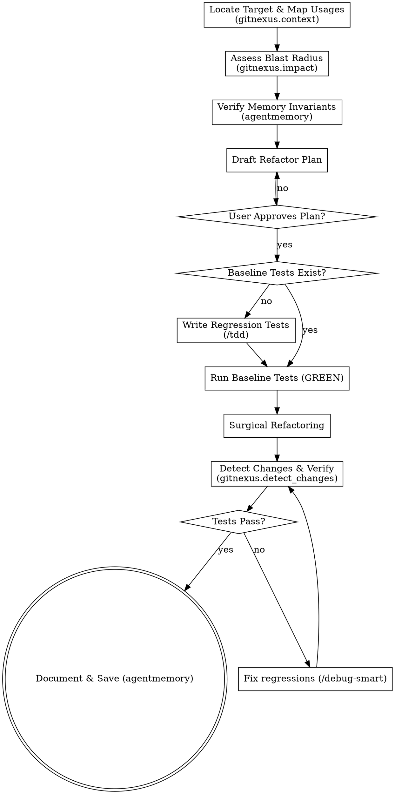

# Smart Refactor Skill (/refactor)

This skill implements a safe, disciplined refactoring process to improve readability, performance, or extensibility while ensuring zero regressions and keeping changes strictly surgical.

<HARD-GATE>
Do NOT refactor any code without first establishing a baseline test suite that verifies the existing behavior. If no tests exist for the target module, you MUST write them before proceeding with the refactor.
</HARD-GATE>

## Anti-Pattern: "Refactoring by Vibe"
Refactoring without knowing the full blast radius, changing adjacent files "while you are here," or introducing speculative abstractions for hypothetical future needs. These cause hidden regressions and context rot.

---

## Checklist

You MUST complete these steps in order:

1. **Map Codebase Context & Usages** — Call `gitnexus.context` on the target class or function to find all callers, callees, imports, and definitions.
2. **Analyze Blast Radius** — Call `gitnexus.impact` to assess the blast radius. List all affected downstream files in a "Downstream Dependency Map".
3. **Query Memory Constraints** — Search `agentmemory` for past design discussions, performance pitfalls, or constraints related to the target code.
4. **Draft Refactoring Plan** — Write the plan to `docs/superpowers/plans/YYYY-MM-DD-refactor-<target>.md`. Define the surgical target, invariants, and success criteria.
5. **Establish Baseline Tests** — Run the existing test suite to ensure everything is green. If tests do not cover the target code, write regression tests using `/tdd` first.
6. **Surgical Implementation** — Apply the refactoring using the simplest possible code. Match the existing style and avoid over-engineering.
7. **Verify Scope & Regressions** — Call `gitnexus.detect_changes` to ensure only the planned files were modified. Run all tests.
8. **Document & Persist** — Update `walkthrough.md` and save the refactoring outcome details into `agentmemory`.

---

## Process Flow

---

## Refactoring Best Practices

*   **Refactor Small Steps**: Keep refactoring commits tiny. If you are renaming a method and modifying its implementation, do them as separate commits.
*   **Coordinate Renames**: If renaming public symbols or API surfaces, use `gitnexus.rename` to propagate the changes across the workspace.
*   **Isolate Side-Effects**: Break highly coupled logic into clean, single-purpose functions communicating through well-defined interfaces.
*   **Keep comments up to date**: If you change the behavior or interface, ensure docstrings and comments are updated surgicaly.

---

## 🧠 Karpathy-Inspired Coding Guidelines

To ensure robust and maintainable code, always follow these four core principles inspired by Andrej Karpathy:

### 1. Think Before Coding
**Don't assume. Don't hide confusion. Surface tradeoffs.**
- State your assumptions explicitly. If uncertain, ask.
- If multiple interpretations exist, present them - don't pick silently.
- If a simpler approach exists, say so. Push back when warranted.
- If something is unclear, stop. Name what's confusing. Ask.

### 2. Simplicity First
**Minimum code that solves the problem. Nothing speculative.**
- No features beyond what was asked.
- No abstractions for single-use code.
- No "flexibility" or "configurability" that wasn't requested.
- No error handling for impossible scenarios.
- If you write 200 lines and it could be 50, rewrite it.
- Ask yourself: "Would a senior engineer say this is overcomplicated?" If yes, simplify.

### 3. Surgical Changes
**Touch only what you must. Clean up only your own mess.**
- Don't "improve" adjacent code, comments, or formatting.
- Don't refactor things that aren't broken.
- Match existing style, even if you'd do it differently.
- If you notice unrelated dead code, mention it - don't delete it.
- Remove imports/variables/functions that YOUR changes made unused. Don't remove pre-existing dead code unless asked.
- Every changed line should trace directly to the user's request.

### 4. Goal-Driven Execution
**Define success criteria. Loop until verified.**
- Transform tasks into verifiable goals (e.g., "Add validation" -> "Write tests for invalid inputs, then make them pass").
- For multi-step tasks, state a brief plan and verify each step.
- Strong success criteria let you loop independently. Weak criteria require constant clarification.
