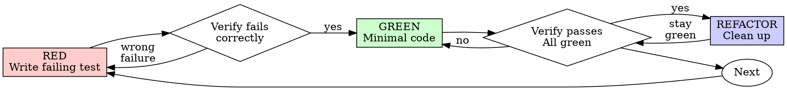

# Test-Driven Development Skill (/tdd)

This skill implements the strict Superpowers Test-Driven Development (TDD) workflow in the workspace, combined with AgentMemory to track successful test outcomes.

Write the test first. Watch it fail. Write minimal code to pass.

<IMPORTANT>
If you didn't watch the test fail, you don't know if it tests the right thing.
Violating the letter of the rules is violating the spirit of the rules.
</IMPORTANT>

## The Iron Law

```
NO PRODUCTION CODE WITHOUT A FAILING TEST FIRST
```

Write code before the test? Delete it. Start over.
**No exceptions:**
- Don't keep it as "reference".
- Don't "adapt" it while writing tests.
- Don't look at it.
- Delete means delete.
Implement fresh from tests. Period.

---

## Red-Green-Refactor Cycle



### 1. RED - Write Failing Test
Write one minimal test showing what should happen.
* **Requirements**:
  - Focus on one behavior.
  - Clear descriptive name.
  - Real code (no mocks unless unavoidable).

### 2. Verify RED - Watch It Fail (MANDATORY)
Run the test suite using the workspace runner.
* Confirm:
  - Test fails (not syntax error).
  - Failure message is expected (verifying active test).
  - Fails because feature is missing (not typos).

### 3. GREEN - Minimal Code
Write the simplest code to make the tests pass.
* Follow Karpathy's **Simplicity First** principle — do not add extra logic, speculative abstractions, or helper functions.

### 4. Verify GREEN - Watch It Pass (MANDATORY)
Run the test suite.
* Confirm:
  - Test passes.
  - Other tests still pass (no regression).
  - Output pristine (no errors or warnings).

### 5. REFACTOR - Clean Up
* Remove duplication, improve naming, and extract helpers.
* Run the tests after every minor change to ensure no regressions.
* Call `agentmemory` to save the successful test outcomes and implementation footprint.

---

## Why Order Matters

* **Tests written after code pass immediately**: Passing immediately proves nothing. It might test the wrong thing, test the implementation rather than behavior, or miss edge cases.
* **Manual testing is ad-hoc**: No record, cannot be re-run automatically when code changes. Automated tests are systematic.
* **Sunk cost fallacy**: Keeping unverified code is technical debt. Delete and rewrite with TDD.
* **TDD is pragmatic**: It finds bugs before committing, prevents regressions, documents behavior, and enables refactoring.

---

## Common Rationalizations

| Excuse | Reality |
|--------|---------|
| "Too simple to test" | Simple code breaks. Test takes 30 seconds. |
| "I'll test after" | Tests passing immediately prove nothing. |
| "Already manually tested" | Ad-hoc ≠ systematic. No record, can't re-run. |
| "Deleting X hours is wasteful" | Sunk cost fallacy. Keeping unverified code is technical debt. |
| "Keep as reference, write tests first" | You'll adapt it. That's testing after. Delete means delete. |

## Red Flags - STOP and Start Over
* Code before test.
* Test after implementation.
* Test passes immediately.
* Can't explain why test failed.
* "Keep as reference" or "adapt existing code".
* "Already spent X hours, deleting is wasteful".
* "TDD is dogmatic, I'm being pragmatic".

---

## Verification Checklist
Before marking work complete:
- [ ] Every new function/method has a test.
- [ ] Watched each test fail before implementing.
- [ ] Each test failed for expected reason.
- [ ] Wrote minimal code to pass each test.
- [ ] All tests pass.
- [ ] Output pristine.
- [ ] Mocks only if unavoidable.

---

## 🧠 Karpathy-Inspired Coding Guidelines

To ensure robust and maintainable code, always follow these four core principles inspired by Andrej Karpathy:

### 1. Think Before Coding
**Don't assume. Don't hide confusion. Surface tradeoffs.**
- State your assumptions explicitly. If uncertain, ask.
- If multiple interpretations exist, present them - don't pick silently.
- If a simpler approach exists, say so. Push back when warranted.
- If something is unclear, stop. Name what's confusing. Ask.

### 2. Simplicity First
**Minimum code that solves the problem. Nothing speculative.**
- No features beyond what was asked.
- No abstractions for single-use code.
- No "flexibility" or "configurability" that wasn't requested.
- No error handling for impossible scenarios.
- If you write 200 lines and it could be 50, rewrite it.
- Ask yourself: "Would a senior engineer say this is overcomplicated?" If yes, simplify.

### 3. Surgical Changes
**Touch only what you must. Clean up only your own mess.**
- Don't "improve" adjacent code, comments, or formatting.
- Don't refactor things that aren't broken.
- Match existing style, even if you'd do it differently.
- If you notice unrelated dead code, mention it - don't delete it.
- Remove imports/variables/functions that YOUR changes made unused. Don't remove pre-existing dead code unless asked.
- Every changed line should trace directly to the user's request.

### 4. Goal-Driven Execution
**Define success criteria. Loop until verified.**
- Transform tasks into verifiable goals (e.g., "Add validation" -> "Write tests for invalid inputs, then make them pass").
- For multi-step tasks, state a brief plan and verify each step.
- Strong success criteria let you loop independently. Weak criteria require constant clarification.
