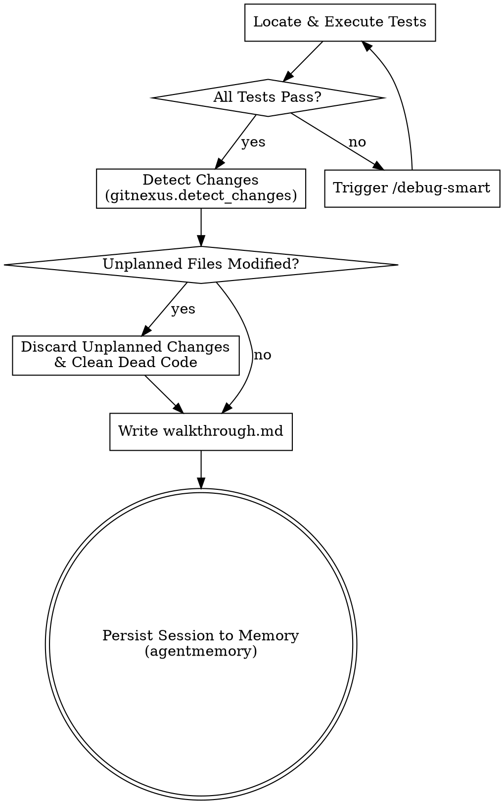

# Verify Changes Skill (/verify-changes)

This skill automates testing, file modification scope checks, session documentation, and memory database updates before completing a task.

---

## 🛠️ Step-by-Step Execution Protocol

### 🟩 Step 1: Run Automated Tests
* Locate and run all relevant test files. If the workspace is React/Spring Boot, run:
  - Frontend: `npm test` or `npm run test`
  - Backend: `./mvnw test` or `./gradlew test`
* **Evaluate Results**:
  - **All Pass**: Proceed to Step 2.
  - **Failures**: Capture error outputs, halt execution immediately, and run `/debug-smart` to resolve regressions.

### 🟦 Step 2: Validate Change Scope (GitNexus)
* Call `gitnexus.detect_changes` on the workspace directory.
* Compare the modified files with the approved `implementation_plan.md` tasks list:
  - If any unplanned files were modified, restore/discard those changes (unless they were explicitly approved refactoring steps).
  - Clean up any unused imports, dead variables, or debugging print statements introduced during implementation.

### 🟨 Step 3: Write Walkthrough Document
Generate a detailed `walkthrough.md` file in the workspace containing:
1. **Goal Verification**: Explicit statement of what was accomplished and how it meets the original user request.
2. **Completed Task List**: Markdown check list mapping to `task.md`.
3. **Change Log Table**: Listing modified file paths, added lines count, and deleted lines count.
4. **Test Run Console Output**: Raw code blocks showing the passing tests.

### 🟧 Step 4: Persist Session Memory
* Call `agentmemory`/`openclaw-memory` tools to save the session outcome.
* Store:
  - Description of the feature/bugfix implemented.
  - List of modified files and symbols.
  - Test command used and outcome status.

---

## Process Flow

---

## 🧠 Karpathy-Inspired Coding Guidelines

To ensure robust and maintainable code, always follow these four core principles inspired by Andrej Karpathy:

### 1. Think Before Coding
**Don't assume. Don't hide confusion. Surface tradeoffs.**
- State your assumptions explicitly. If uncertain, ask.
- If multiple interpretations exist, present them - don't pick silently.
- If a simpler approach exists, say so. Push back when warranted.
- If something is unclear, stop. Name what's confusing. Ask.

### 2. Simplicity First
**Minimum code that solves the problem. Nothing speculative.**
- No features beyond what was asked.
- No abstractions for single-use code.
- No "flexibility" or "configurability" that wasn't requested.
- No error handling for impossible scenarios.
- If you write 200 lines and it could be 50, rewrite it.
- Ask yourself: "Would a senior engineer say this is overcomplicated?" If yes, simplify.

### 3. Surgical Changes
**Touch only what you must. Clean up only your own mess.**
- Don't "improve" adjacent code, comments, or formatting.
- Don't refactor things that aren't broken.
- Match existing style, even if you'd do it differently.
- If you notice unrelated dead code, mention it - don't delete it.
- Remove imports/variables/functions that YOUR changes made unused. Don't remove pre-existing dead code unless asked.
- Every changed line should trace directly to the user's request.

### 4. Goal-Driven Execution
**Define success criteria. Loop until verified.**
- Transform tasks into verifiable goals (e.g., "Add validation" -> "Write tests for invalid inputs, then make them pass").
- For multi-step tasks, state a brief plan and verify each step.
- Strong success criteria let you loop independently. Weak criteria require constant clarification.
