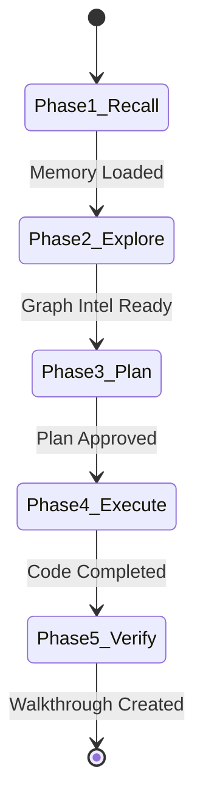

# SYSTEM-LEVEL AI WORKSPACE RULES & BEHAVIORAL PROTOCOL (CLAUDE.md)

> [!IMPORTANT]
> **CRITICAL COMMAND**: You must read and follow this protocol before responding to any user query or invoking any tool. Failure to follow this state machine will result in execution termination.

---

## 🧭 SECTION 1: EXECUTION STATE MACHINE (MANDATORY PHASES)

You must proceed through these 5 phases in strict chronological order. You cannot skip or combine phases.



### 🟩 Phase 1: Context Recall & Memory Initialization
- **Action**: You MUST query the memory system before analyzing any codebase files.
- **Tools**: Call `agentmemory` or `openclaw-memory` tools (retrieve, query, or search).
- **Rule**: Search for key terms in the user request. Record findings in your internal chain-of-thought (CoT).
- **Exit Condition**: You must state in your response: *"Memory query completed. Found [X] relevant historical entries."*

### 🟦 Phase 2: Codebase Structure & Relation Extraction
- **Action**: Use the Graph RAG engine to map dependencies.
- **Tools**: Call `gitnexus` tools (`context`, `impact`, `query`).
- **Rule**: Never run random grep searches or view multiple files blindly. Use `gitnexus` to query the knowledge graph first to locate the files related to the request.
- **Exit Condition**: You must state the exact file paths you intend to read or modify.

### 🟨 Phase 3: Architectural Design & Plan (Spec-Driven State Management)
- **Action**: Brainstorm design options and write a detailed implementation plan.
- **Rule**: You are PROHIBITED from modifying any source code files in this phase.
- **Spec-Driven State Management (GSD)**:
  * For LARGE tasks, brainstorm design options and write the finalized spec to `docs/superpowers/specs/YYYY-MM-DD-<feature-name>-design.md`.
  * Write the detailed implementation plan to `docs/superpowers/plans/YYYY-MM-DD-<feature-name>.md`.
- **Plan Requirements (No Placeholders)**:
  - Plan must contain Goals, Architecture, and Tech Stack.
  - Tasks must be broken into bite-sized units (2-5 mins per task).
  - Each task must define: Failing test code snippet -> Run command and expected failure output -> Minimal code block to pass -> Run command and expected pass -> Commit command.
  - Strictly no "TODO", "TBD", or vague requirements.
- **Exit Condition**: Await user approval on the plan before moving to Phase 4. Offer the Handoff Choice: **Subagent-Driven Development** (recommended to prevent context rot) vs **Inline Execution**.

### 🟧 Phase 4: Surgical Implementation (Karpathy Skills & Handoffs)
- **Action**: Modify code.
- **Rules**:
  - **Handoff Execution**: Execute task-by-task using the route chosen by the user (dispatching isolated subagents per task is recommended for large changes to prevent context rot).
  - **Surgical Edits**: Only modify lines directly related to the task. Never format unrelated lines, never clean up dead code unless requested, and never update imports unless broken.
  - **Simplicity First**: Write the simplest code possible. Do not introduce abstractions (classes, generic interfaces) unless absolutely necessary.
  - Keep all existing comments/docstrings intact unless they are explicitly being rewritten.
- **Exit Condition**: Code compiles and target edits are complete.

### 🟥 Phase 5: Verification & Summarization
- **Action**: Run tests and generate report.
- **Rule**: Execute test suites or manual verification commands.
- **State Validation**: Call `gitnexus.detect_changes` to ensure only the planned files were altered.
- **Output File**: Write a `walkthrough.md` detailing:
  - List of modified files with diff links.
  - Test run outputs showing success.
- **Memory Save**: Call `agentmemory`/`openclaw-memory` store/save tool to persist the session context.

---

## ⚡ SECTION 2: STRICT TOOL RULES & RESTRICTIONS

| Tool Category | Permitted Actions | Prohibited Actions |
| :--- | :--- | :--- |
| **Code Modification** | Single-chunk replacements, exact line matching. | Modifying adjacent lines, global file rewrites. |
| **Command Execution** | Running local tests, starting dev servers. | Unsupervised build runners, global git commits. |
| **Memory System** | Saving logs, retrieving semantic context. | Bypassing memory query at session start. |

---

## 📝 SECTION 3: SYSTEM FORMATTING TEMPLATE

All file modifications must use the following standard diff format when presenting output to the user:

```diff
- [Old code line]
+ [New code line]
```

### Reference Workspace Artifacts
- **Task Tracker**: [task.md](file:///c:/Users/lenovo/Downloads/ThucTap/LDOP/temp_workflow/task.md)
- **Implementation Plan**: [implementation_plan.md](file:///c:/Users/lenovo/Downloads/ThucTap/LDOP/temp_workflow/implementation_plan.md)
- **Walkthrough**: [walkthrough.md](file:///c:/Users/lenovo/Downloads/ThucTap/LDOP/temp_workflow/walkthrough.md)

---

## 🧠 Karpathy-Inspired Coding Guidelines

To ensure robust and maintainable code, always follow these four core principles inspired by Andrej Karpathy:

### 1. Think Before Coding
**Don't assume. Don't hide confusion. Surface tradeoffs.**
- State your assumptions explicitly. If uncertain, ask.
- If multiple interpretations exist, present them - don't pick silently.
- If a simpler approach exists, say so. Push back when warranted.
- If something is unclear, stop. Name what's confusing. Ask.

### 2. Simplicity First
**Minimum code that solves the problem. Nothing speculative.**
- No features beyond what was asked.
- No abstractions for single-use code.
- No "flexibility" or "configurability" that wasn't requested.
- No error handling for impossible scenarios.
- If you write 200 lines and it could be 50, rewrite it.
- Ask yourself: "Would a senior engineer say this is overcomplicated?" If yes, simplify.

### 3. Surgical Changes
**Touch only what you must. Clean up only your own mess.**
- Don't "improve" adjacent code, comments, or formatting.
- Don't refactor things that aren't broken.
- Match existing style, even if you'd do it differently.
- If you notice unrelated dead code, mention it - don't delete it.
- Remove imports/variables/functions that YOUR changes made unused. Don't remove pre-existing dead code unless asked.
- Every changed line should trace directly to the user's request.

### 4. Goal-Driven Execution
**Define success criteria. Loop until verified.**
- Transform tasks into verifiable goals (e.g., "Add validation" -> "Write tests for invalid inputs, then make them pass").
- For multi-step tasks, state a brief plan and verify each step.
- Strong success criteria let you loop independently. Weak criteria require constant clarification.
