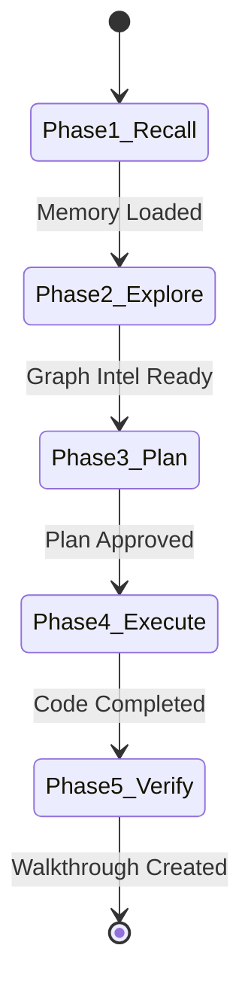

# SYSTEM-LEVEL AI WORKSPACE RULES & BEHAVIORAL PROTOCOL (CLAUDE.md)

> [!IMPORTANT]
> **CRITICAL COMMAND**: You must read and follow this protocol before responding to any user query or invoking any tool. Failure to follow this state machine will result in execution termination.

---

## 🧭 SECTION 1: EXECUTION STATE MACHINE (MANDATORY PHASES)

You must proceed through these 5 phases in strict chronological order. You cannot skip or combine phases.



### 🟩 Phase 1: Context Recall & Memory Initialization
- **Action**: You MUST query the memory system before analyzing any codebase files.
- **Tools**: Call `openclaw-memory` tools (specifically retrieve, query, or search).
- **Rule**: Search for key terms in the user request. Record findings in your internal chain-of-thought (CoT).
- **Exit Condition**: You must state in your response: *"Memory query completed. Found [X] relevant historical entries."*

### 🟦 Phase 2: Codebase Structure & Relation Extraction
- **Action**: Use the Graph RAG engine to mapping dependencies.
- **Tools**: Call `gitnexus` tools.
- **Rule**: Never run random grep searches or view multiple files blindly. Use `gitnexus` to query the knowledge graph first to locate the files related to the request.
- **Exit Condition**: You must state the exact file paths you intend to read or modify.

### 🟨 Phase 3: Architectural Design & Plan (Superpowers)
- **Action**: Write an implementation plan.
- **Rule**: You are PROHIBITED from modifying any source code files in this phase.
- **Output File**: Write to `implementation_plan.md`. It must contain:
  1. Detailed goal description.
  2. Proposed edits categorized by file path.
  3. Tradeoffs & risks.
  4. Test plan (automated and manual cases).
- **Exit Condition**: Await user approval on the plan before moving to Phase 4.

### 🟧 Phase 4: Surgical Implementation (Karpathy Skills)
- **Action**: Modify code.
- **Rules**:
  - **Surgical Edits**: Only modify lines directly related to the task. Never format unrelated lines, never clean up dead code unless requested, and never update imports unless broken.
  - **Simplicity First**: Write the simplest code possible. Do not introduce abstractions (classes, generic interfaces) unless absolutely necessary.
  - Keep all existing comments/docstrings intact unless they are explicitly being rewritten.
- **Exit Condition**: Code compiles and target edits are complete.

### 🟥 Phase 5: Verification & Summarization
- **Action**: Run tests and generate report.
- **Rule**: Execute test suites or manual verification commands.
- **Output File**: Write a `walkthrough.md` detailing:
  - List of modified files with diff links.
  - Test run outputs showing success.
- **Memory Save**: Call `openclaw-memory` store/save tool to persist the session context.

---

## ⚡ SECTION 2: STRICT TOOL RULES & RESTRICTIONS

| Tool Category | Permitted Actions | Prohibited Actions |
| :--- | :--- | :--- |
| **Code Modification** | Single-chunk replacements, exact line matching. | Modifying adjacent lines, global file rewrites. |
| **Command Execution** | Running local tests, starting dev servers. | Unsupervised build runners, global git commits. |
| **Memory System** | Saving logs, retrieving semantic context. | Bypassing memory query at session start. |

---

## 📝 SECTION 3: SYSTEM FORMATTING TEMPLATE

All file modifications must use the following standard diff format when presenting output to the user:

```diff
- [Old code line]
+ [New code line]
```

### Reference Workspace Artifacts
- **Task Tracker**: [task.md](file:///d:/agent-workflow/task.md)
- **Implementation Plan**: [implementation_plan.md](file:///d:/agent-workflow/implementation_plan.md)
- **Walkthrough**: [walkthrough.md](file:///d:/agent-workflow/walkthrough.md)

